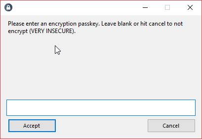
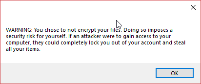
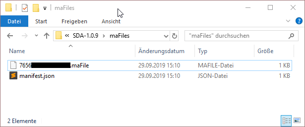
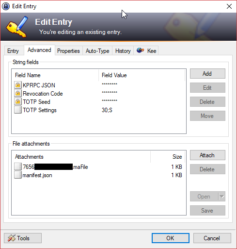

# Obtaining TOTP secret from Steam Desktop Authenticator (SDA)

This is a small guide to receive the Steam TOTP secret from the [Steam Desktop Authenticator (SDA)](https://github.com/Jessecar96/SteamDesktopAuthenticator).

It has the advantage, that is does not need a rooted Android Phone, and you can backup the configuration files of SDA into your KeePass Database, so that you can restore it.

In the first step download the [program files](https://github.com/Jessecar96/SteamDesktopAuthenticator/releases) using the `SDA*.zip`—not the source packages—file and extract it. Start the executable and follow the instructions to setup the Authenticator, except encrypting the files.

## Step 1: Activating the Authenticator

Start the `Steam Desktop Authenticator.exe` executable, and follow the instructions of SDA to setup it as an authenticator for your Steam account, but when asking for an encryption passkey choose *Cancel*. We need the file unencrypted to extract the secret later:



After that there is an additional confirmation step, which explains that this is a really bad idea. However, we will move the secret to our encrypted KeePass Database, so in this special case this is OK.



After this there are some additional step. Follow them as instructed.


## Step2: Obtain the secret from the file

In the folder of your `Steam Desktop Authenticator.exe` there was a new folder created, called `maFiles`. It should include two files (there are more if you have activated multiple steam accounts):



Now open the `[some_number].maFile`  file with a text editor. The file extension `maFile` is not linked with an text editor, so you have to open the file manually with the open dialogue of your text editor. The file should have the following content (generated codes were replaced):

```json
{"shared_secret":"[some_code]","serial_number":"[some_code]","revocation_code":"[some_code]","uri":"otpauth://totp/Steam:[your_Steam_login]?secret=[TOTP_secret]&issuer=Steam","server_time":1569762545,"account_name":"[your_Steam_login]","token_gid":"1429bb44bf725072","identity_secret":"[some_code]","secret_1":"[some_code]","status":1,"device_id":"android:[some_code]","fully_enrolled":true,"Session":{"SessionID":"[some_code]","SteamLogin":"[some_code]","SteamLoginSecure":"[some_code]","WebCookie":"[some_code]","OAuthToken":"[some_code]","SteamID":[some_code]}}
```

The `TOTP_secret` is the required field we are looking for, and the only code which is required for the KeePass TOTP plugin. Copy it and use it in the *Setup TOTP* dialogue of the plugin.


## Step 3: Backup the files

You should backup the two files in the `maFiles`, so you can restore the SDA program at a later point. You can use KeePass TOTP plugin to generate the OTPs for steam, but (1) it might be still useful as a fallback solution and (2) you still require SDA to deactivate this secret and switch to another authenticator, for example the Smartphone app again (If you do not do it through SDA you have to “restore” your steam account which is a bit problematic).

It is up to you how you backup it, but since it contains the secret is should be a save place. It could be a dedicated USB-stick, but a very good place is attaching them to your KeePass entry:




## Step 4: Delete the maFiles

Since we obtained the secret and backuped the two generated maFiles, we can now delete the maFiles. Remember they contain your secrets *unencrypted*, so this is a very important step. Do not only move the files to the trash bin, really delete them! At best you [securely delete them](https://www.howtogeek.com/72130/learn-how-to-securely-delete-files-in-windows/) (also called wiping or shreddering).